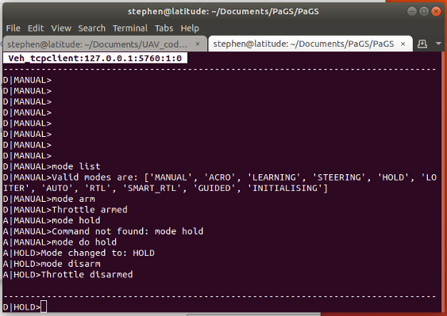

Mode Module
===============

``module load modeModule``

Summary
-------

The module allows the mode and arming status of the vehicle to be controlled.

Commands
--------

``mode list``. List the valid modes for the vehicle

``mode do <mode>``. Switch to mode <mode>. The <mode> is not case sensitive.

``mode arm``. Send an arming command to the vehicle

``mode disarm``. Send a disarm command to the vehicle.

``mode reboot``. Reboot the Flight Controller.

