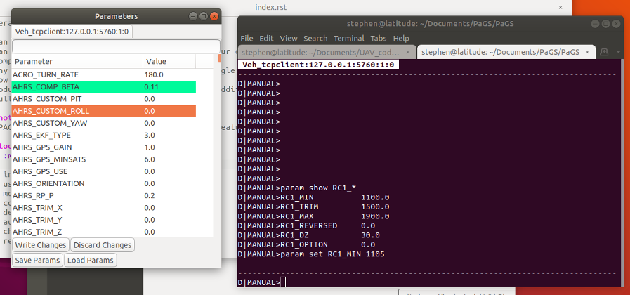

Terminal Module
===============

``module load paramModule``

Summary
-------

This module provides commands an a GUI for reading and writing vehicle parameters.

Note that the parameters are not checked for correctness before being sent to the vehicle.

Commands
--------

``param download``. Download (or refresh) the parameters from the vehicle. Required before any other parameters commands can be used.

``param show <param>``. Show a parameter's current value. Wildcards can be used, for example ``param show RC1_*``

``param set <param>``. Set a new value for a parameter.

``param load <filename>``. Load the parameters from file.

``param save <filename>``. Save the parameters to file.

GUI
---

<screenshot>

The GUI will automatically populate after a ``param download`` has been performed. Each vehicle will have it's own tab in the window.

The text field at the top can be used to filter parameters.

When a parameter is edited, it will be highlighted until written to the vehicle.
