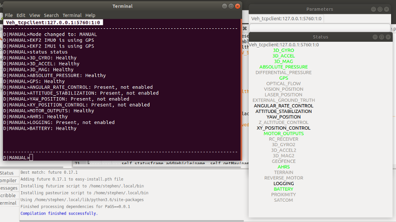

Status Module
===============

``module load statusModule``

Summary
-------

The module displays the current sub-system status of the Vehicle, both in the
console and in a GUI

In the GUI, the following colours are used for the subsystem status:

- Grey: System not present
- Black: Present, not enabled
- Red: Present, enabled, not healthy
- Green: Present, enabled, healthy

Commands
--------

``status status``. Show the current status of the vehicle.

