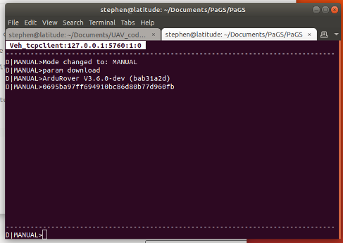

Terminal Module
===============

``module load terminalModule``

Summary
-------

This module provides a terminal-based UI for displaying vehicle status and sending commands to vehicles.

Each vehicle has it's own tab and command interpreter.

Use ctrl+right and ctrl+left to navigate through the vehicle tabs.

The prompt show the vehicle's current mode and arming status. "D" for disarmed and "A" for armed.

Commands
--------

N/A
